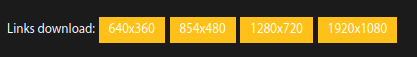

# gobulk ⏬
Gets your favorite anime all episode download link from [gogoanime](https://gogoanime.tel)
You can batch download from your favorite download manager.

* [Setup](https://github.com/lemonadeforlife/gobulk/main/README.md#setup)
  * [Install Requiremnets file](https://github.com/lemonadeforlife/gobulk/blob/main/README.md#install-python-requirements-file)
  * [token.json](https://github.com/lemonadeforlife/gobulk/blob/main/README.md#enter-your-gogoanime-account-in-tokenjson-file)
	
* [Usage](https://github.com/lemonadeforlife/gobulk/blob/main/README.md#usage)
  * [Command Formats](https://github.com/lemonadeforlife/gobulk/blob/main/README.md#command-formats)
  * [Search & Download](https://github.com/lemonadeforlife/gobulk/blob/main/README.md#search--download)
  * [Access File From Anywhere(For linux User)](https://github.com/lemonadeforlife/gobulk/blob/main/README.md#access-file-from-anywherefor-linux-user)
<br>
<br>
<br>
## Setup
#### Install python requirements file:
```
python3 -m pip install -r requirements.txt
```
Don't worry I didn't use any selenium. Only requests and Beautifulsoup <br/>Tested on python3.8 & python3.10<br/>
#### Enter your gogoanime account in token.json file
If you don't have gogoanime account then [create](https://gogoanime.tel/login.html) one. Because now gogoanime gives download access only if we log in.<br>
 <br/><br/>
**Create key.json file and the format will be exactly like the one below:**
```json
{
	"email": "your gogoanime email",
	"password": "your gogoanime password",
	"user-agent": "enter your user-agent"
}
```

Get your user-agent from [here](https://www.whatismybrowser.com/detect/what-is-my-user-agent/)<br>
Because even though you have entered the correct email and password<br>The server will reject and return **403**.<br>Because gogoanime doesn't accept bot requests so we are using custom headers and pretending like a browser.

<b>Example key.json file</b>:
```json
{
	"email": "testmail@gmail.com",
	"password": "testpasswd",
	"user-agent": "Mozilla/5.0 (Windows NT 10.0; Win64; x64) AppleWebKit/537.36 (KHTML, like Gecko) Chrome/104.0.0.0 Safari/537.36"
}
```
## Usage:
```
downime URL QUALITY OPTIONS
```
By default resolutions is 720 and it will automatically get whole episode download link.<br>
Example:
```bash
# To download 480
$ downime URL 480

# OR
$ downime URL 720x480
```
*[Note: It doesn't convert any video. It's just a video link grabber. If the spicified resolution found it will return the link]*

**To get specific episode download with default resolution**:
```
downime URL episode_no
```
Example: (To get episode no. 20 from an anime with default resolution)
```
downime https://gogoanime.tel/category/3-gatsu-no-lion 20
```
<b>To get specific episode download with custom resolution</b>:
```
downime URL quality episode_no
```
Example: (To get episode no. 20 from an anime with custom resolution)
```
downime https://gogoanime.tel/category/3-gatsu-no-lion 1080 20
```
<br>

**It also supports range**. To specify range you need to use `colon(:)`.Its work just like Python slice.
```
downime URL episode_no:episode_no
```
Example:(To get episode no. 7-13 download link from an anime with custom resolution)
```bash
$ downime URL 1920x1080 7:13

# OR

$ downime URL 1080 7:13
```
<br>

<b>It has exclude options.</b> Many times we want to exclude fillers or episodes that we already downloaded or by the time some download links might expire while downloading. In that situation excluding options come handy.
```
downime URL QUALITY EPISODE EXCLUDE
```
For single exclude you have to use comma(,).If you want to exclude only episode 5 then you have to use `5,` same goes for single range if you want to exclude from range 40 to 47 it will be `40-47,`
Example:
```bash

# This command will get download link of ONE PIECE in 480p all episode except 5
$ downime https://gogoanime.tel/category/one-piece 480 5,

# This command will get download link of ONE PIECE in 720 18 to 25 except 23
$ downime https://gogoanime.tel/category/one-piece 720 18:25 23,

# This command will get download link of One Piece in 1080 25 to 80 except 40 to 47
$ downime https://gogoanime.tel/category/one-piece 720 25:80 40-47,
```
now there are some cases where you want to get rid of multiple episodes. In that case you don't need to use `comma(,)` at the end
```bash
# This command will get download link of ONE PIECE in 1080p 100 episodes except it will ignore 40 to 50,63,75,84 to 87,90
$ downime https://gogoanime.tel/category/one-piece 1080 :100 40-50,63,75,84-87,90
```

### Command Formats:
```bash
# To get all episode download link with default resolutions or 720p
$ downime https://gogoanime.tel/category/one-piece

# To get download link from 20 to the end with 360p except 36 to 39
$ downime https://gogoanime.tel/category/great-teacher-onizuka 360 20: 36-39,

# To get all episode download link with default resolution except episode 1 to 10
$ downime https://gogoanime.tel/category/great-teacher-onizuka 1-10,
```
### Search & Download
Don't worry its very interactive. Just type:
````
downime search
````

* To specify range use `:` (colon) example-> 1:5</li>

* To exclude single episode or episode range use `,` (comma) example: 1-5, OR 2,</li>

* To exclude multiple episode or multiple range or both use coma as well but this time it doesn't need add at end.<br>
	example: `2,3,5` or `1-5,10-15` or `1-5,9,11,20-13`


### Access File from anywhere(For Linux User):
  To access this file from anywhere you just need to specify your key.json path in downime.py line no.8 <br>
  **Example**: `with open('home/username/app/key.json','r') as f:`<br>
  Drag the `downime.py` file in `/usr/local/bin` by holding ctrl+shift key and rename the shortcut from `downime.py` to `downime`
now you can command:
```
downime link resolution
```
**Example:**
```
downime https://gogoanime.tel/category/3-gatsu-no-lion 1080
```
